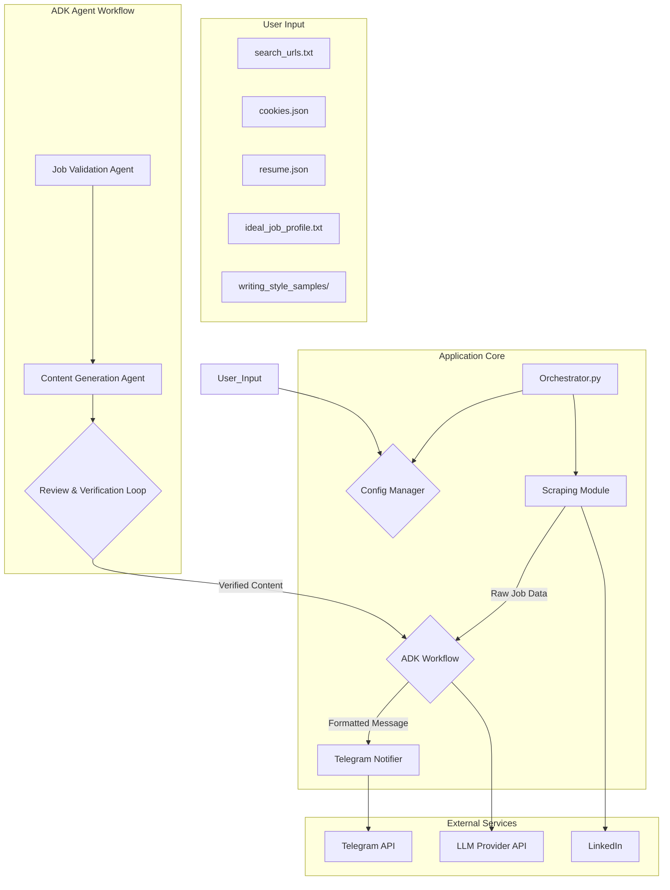

# 3. System Architecture: AI Job Application Assistant

## 1. Architecture Overview

This system is designed as a modular, sequential pipeline orchestrated by the Google Agent Development Kit (ADK). The architecture emphasizes separation of concerns, with each step in the workflow handled by a specialized component. Data will be passed between components in a structured format.

The primary components are:
1.  **Orchestrator:** The main entry point that runs the agentic workflow in sequence.
2.  **Config Manager:** A utility to load and provide all configuration data (URLs, API keys, file paths).
3.  **Scraping Module:** A Selenium-based module responsible for fetching job posting data from LinkedIn.
4.  **ADK Agent Workflow:** A series of ADK agents that process the scraped data.
5.  **Notification Service:** A simple module to send formatted messages to the Telegram API.

## 2. System Diagram (Mermaid)

## 3. Component Breakdown

### 3.1. Orchestrator (`main.py`)

-   **Purpose:** The main entry point of the application.
-   **Responsibilities:**
    -   Initialize the Config Manager.
    -   Invoke the Scraping Module to get a list of jobs.
    -   Pass the list of jobs to the ADK Workflow for processing.
    -   Take the final, formatted messages from the workflow and send them to the Telegram Notifier.
    -   Handle top-level error handling and logging.

### 3.2. Config Manager (`config.py`)

-   **Purpose:** To load and provide access to all configuration and user-provided data.
-   **Responsibilities:**
    -   Load API keys (LLM Provider, Telegram) from environment variables or a `.env` file.
    -   Read the list of URLs from `search_urls.txt`.
    -   Load the `cookies.json` file.
    -   Load the `resume.json` data structure.
    -   Read the `ideal_job_profile.txt` content.
    -   Load all documents from the `writing_style_samples/` directory.

### 3.3. Scraping Module (`scraper.py`)

-   **Purpose:** To interact with LinkedIn using Selenium.
-   **Responsibilities:**
    -   Initialize a Selenium WebDriver.
    -   Load the session cookies from the Config Manager to authenticate.
    -   For each URL in `search_urls.txt`:
        -   Navigate to the URL.
        -   Extract the relevant job posting links from the search results page.
        -   Visit each individual job posting link and extract the full job description text.
    -   Return a list of structured objects, each containing the data for one job (Title, Company, URL, Description Text).

### 3.4. ADK Workflow (`workflow.py`)

-   **Purpose:** To orchestrate the sequence of AI-powered agents using Google ADK.
-   **Agents:**
    -   **Job Validation Agent:**
        -   Receives raw job data from the scraper.
        -   Compares each job description against the `ideal_job_profile.txt`.
        -   Filters out non-relevant jobs.
    -   **Content Generation Agent:**
        -   Receives a qualified job and the `resume.json` data.
        -   Generates suggested bullet point changes and a draft cover letter.
    -   **Content Review Agent:**
        -   Acts as a quality gate.
        -   Reviews the generated content for quality and relevance.
        -   Initiates a regeneration loop with feedback if the content is not satisfactory.
-   **Output:** A list of formatted strings, ready to be sent as Telegram messages.

### 3.5. Telegram Notifier (`notifier.py`)

-   **Purpose:** A simple, focused module for sending messages.
-   **Responsibilities:**
    -   Accept a pre-formatted message string.
    -   Make an HTTP POST request to the Telegram Bot API.
    -   Handle basic API response logging (success or failure).

## 4. Data Flow

1.  The **Orchestrator** starts, loading config via the **Config Manager**.
2.  The **Orchestrator** calls the **Scraping Module**.
3.  The **Scraping Module** uses Selenium and the session cookies to fetch job data from LinkedIn, returning a list of job objects.
4.  The **Orchestrator** passes this list to the **ADK Workflow**.
5.  Inside the workflow, the **Job Validation Agent** filters the list.
6.  For each valid job, the **Content Generation Agent** and **Content Review Agent** work in a loop to produce high-quality text.
7.  The workflow returns a list of fully formatted notification messages.
8.  The **Orchestrator** iterates through the messages and sends each one using the **Telegram Notifier**. 